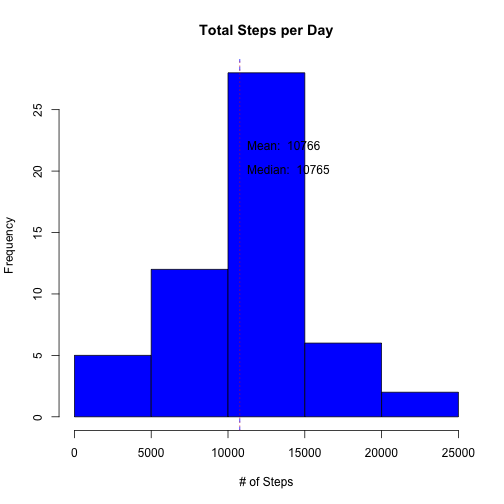
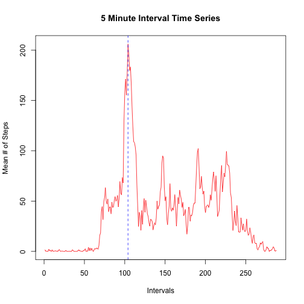
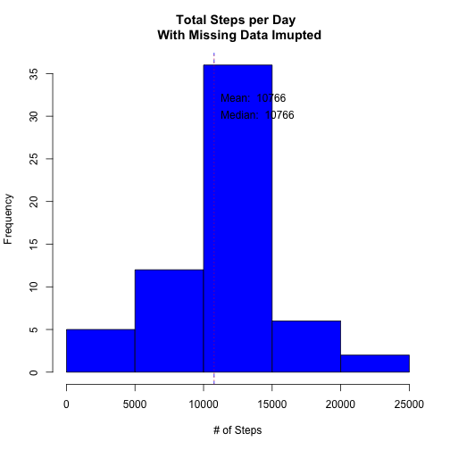
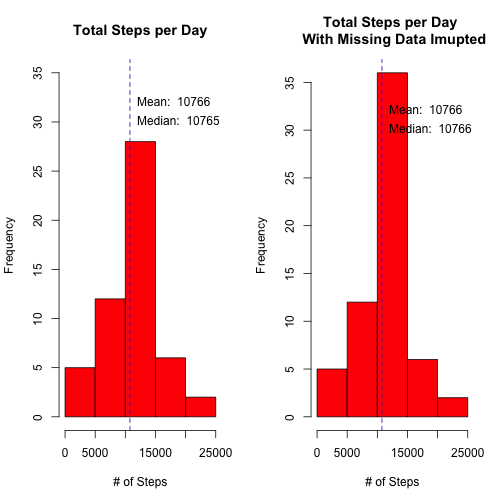
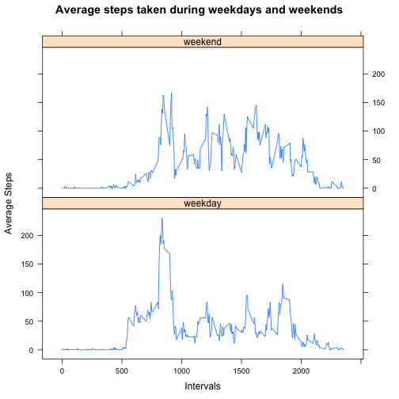

### Reproducible Research: Peer Assessment 1

This report analyzes the data collected from a personal activity monitoring device. The data was collected at 5 minute intervals through out the day. The data consists of two months of data from an anonymous individual collected during the months of October and November, 2012 and include the number of steps taken in 5 minute intervals each day.


### Loading and preprocessing the data

The data is provided in the CSV file activity.csv. First the file is read into a data frame and NAs are removed.


```r
actData <- read.csv("activity.csv")
actCleanData <- actData[!is.na(actData$steps),]
str(actCleanData)
```

```
## 'data.frame':	15264 obs. of  3 variables:
##  $ steps   : int  0 0 0 0 0 0 0 0 0 0 ...
##  $ date    : Factor w/ 61 levels "2012-10-01","2012-10-02",..: 2 2 2 2 2 2 2 2 2 2 ...
##  $ interval: int  0 5 10 15 20 25 30 35 40 45 ...
```

### What is mean total number of steps taken per day?
##### Histogram of Steps taken Daily

```r
splitByDate<-split(actCleanData,actCleanData$date, drop=TRUE)  
dailySteps<-sapply(splitByDate, function(x) sum(x$steps))  
hist(dailySteps, main="Total Steps per Day", xlab="# of Steps", col="blue")
abline(v=mean(dailySteps), lty=2, col="blue")  
abline(v=median(dailySteps), lty=3, col="red")  
text(mean(dailySteps)+10,22,labels=paste("Mean: ",as.integer(mean(dailySteps))), pos=4, col="black")  
text(median(dailySteps)+10,20,labels=paste("Median: ",as.integer(median(dailySteps))), pos=4, col="black")  
```

 

##### Mean of Steps taken Daily
Mean of steps taken daily is calculated below.

```r
mean(dailySteps)                
```

```
## [1] 10766.19
```

##### Median of Steps taken Daily
Median of steps taken daily is calculated below.

```r
median(dailySteps)                    
```

```
## [1] 10765
```

### What is the average daily activity pattern?

We are going to use a time series plot to understand the average daily activity pattern. Below the data is split intervals to plot avearage steps by interval across multiple days.
##### Time Series

```r
splitByInterval <- split(actCleanData,actCleanData$interval, drop=TRUE)     
intervalMean <- sapply(splitByInterval, function(x) mean(x$steps))
plot(intervalMean, type="l",  
     main="5 Minute Interval Time Series", 
     ylab="Mean # of Steps", 
     xlab="Intervals", col="red")                          
abline(v=which.max(intervalMean), lty=2, col="blue")                   
```

 

##### 5 Minutes Interval with Max # of Steps 


```r
mx <- names(which.max(intervalMean))
print(mx)
```

```
## [1] "835"
```

### Imputing missing values

There are 2304 rows with missing values. Missing values are replaced with the **mean value for respective intervals**. As indicated below in the r code, for each missing value, the average # of steps taken during the coresponding intevral (averaged across days) is found and put in place of the missing value.

##### Number of rows with missing value

```r
nrow(actData[is.na(actData$steps),])
```

```
## [1] 2304
```


```r
impData <- actData
for (rownum in 1:nrow(impData)){
        row <- impData[rownum,]
        if (is.na(row$steps))
                {
                meanVal <- intervalMean[as.character(row$interval)]
                if (length(meanVal)==0)
                        meanVal <- 0
                impData[rownum,]$steps <- meanVal
                } 
        }
splitNewByDay <- split(impData,impData$date, drop=TRUE)                  
dailyStepsRev <- sapply(splitNewByDay, function(x) sum(x$steps))   
summary(dailyStepsRev)
```

```
##    Min. 1st Qu.  Median    Mean 3rd Qu.    Max. 
##      41    9819   10770   10770   12810   21190
```

##### Histogram of Steps taken Daily

```r
hist(dailyStepsRev, main='Total Steps per Day \n With Missing Data Imupted', xlab="# of Steps", col="blue")
abline(v=mean(dailyStepsRev), lty=2, col="blue")  
abline(v=median(dailyStepsRev), lty=3, col="red")  
text(mean(dailyStepsRev)+10,32,labels=paste("Mean: ",as.integer(mean(dailyStepsRev))), pos=4, col="black")  
text(median(dailyStepsRev)+10,30,labels=paste("Median: ",as.integer(median(dailyStepsRev))), pos=4, col="black")  
```

 

##### Mean of Steps taken Daily
Mean of steps taken daily is calculated below.

```r
mean(dailyStepsRev)                
```

```
## [1] 10766.19
```
##### Median of Steps taken Daily
Median of steps taken daily is calculated below.

```r
median(dailyStepsRev)                    
```

```
## [1] 10766.19
```
##### Side by Side Comparison of Steps

```r
par(mfrow=c(1,2))
hist(dailySteps, main="Total Steps per Day", xlab="# of Steps", col="red", ylim=c(0,35))
abline(v=mean(dailySteps), lty=2, col="blue")  
abline(v=median(dailySteps), lty=3, col="red")  
text(mean(dailySteps),32,labels=paste("Mean: ",as.integer(mean(dailySteps))), pos=4, col="black")  
text(median(dailySteps),30,labels=paste("Median: ",as.integer(median(dailySteps))), pos=4, col="black")  
hist(dailyStepsRev, main='Total Steps per Day \n With Missing Data Imupted', xlab="# of Steps", col="red")
abline(v=mean(dailyStepsRev), lty=2, col="blue")  
abline(v=median(dailyStepsRev), lty=3, col="red")  
text(mean(dailyStepsRev)+10,32,labels=paste("Mean: ",as.integer(mean(dailyStepsRev))), pos=4, col="black")  
text(median(dailyStepsRev)+10,30,labels=paste("Median: ",as.integer(median(dailyStepsRev))), pos=4, col="black")  
```

 

### Are there differences in activity patterns between weekdays and weekends?

A time series is plotted for steps split by weekday & weekend to understand the differences in activity patterns. First the data is split into 2 categories, weekday and weekend.


```r
impData$date <- as.Date(strptime(impData$date, format="%Y-%m-%d"))
impData$day <- weekdays(impData$date)
for (i in 1:nrow(impData)) {
        if (impData[i,]$day %in% c("Saturday","Sunday")) { 
                impData[i,]$day<-"weekend"  
                }else{
                impData[i,]$day<-"weekday" 
                }
        }
```

##### Time Series Plot

```r
## using plyr package
library(plyr)
cdata <- ddply(impData, c("day", "interval"), summarise, mean = mean(steps) )
library(lattice)
xyplot(mean ~ interval | day, type="l", data = cdata, layout = c(1, 2), xlab="Intervals", ylab="Average Steps", main="Average steps taken during weekdays and weekends")
```

 

During weekends, the number of steps seems to be higher through the day/intervals while during weekdays its more concentrated during the early hours/intervals.
